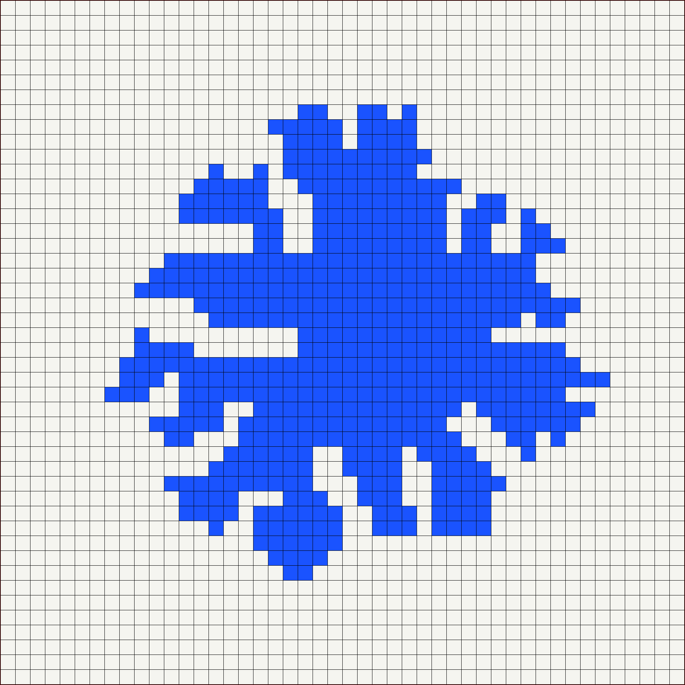

# Random Orthogonal Polygon

A procedural generator for **random orthogonal (rectilinear) polygons** — shapes
whose edges are all axis-aligned, so every corner is a 90° angle. Starting from a
single seed cell, a cellular automaton (CA) grows an organic, blob-like polygon on
a grid over a number of generations and renders it as an image.



*A polygon grown over 24 CA steps on a 46×46 grid.*

## How it works

The world is a 2D grid (default `46×46`, padded with a 1-cell border so neighbor
lookups never fall off the edge). Each cell holds an integer **state**:

| State | Meaning |
|:-----:|---------|
| `0` | empty |
| `1` | candidate flagged by the CA rules |
| `2` | survived the "counter-cross" filter |
| `3` | survived the "counter-hole" filter — eligible to be added |
| `4` | part of the polygon (filled) |

[`Main.py`](Main.py) seeds one random cell to state `4`, then runs `caSteps`
generations. Each generation is a **four-stage pipeline**:

1. **CA rule matcher** — [`CARuleMatcher.py`](CARuleMatcher.py): for every empty
   (`0`) cell, count its filled (`4`) neighbors in the 8-cell Moore neighborhood
   and dispatch to the matching rule (`oneNeighbourRuleMatcher` …
   `sevenNeighboursRuleMatcher`). These hand-written neighborhood templates decide
   whether an empty cell becomes a growth candidate (state `1`), and are what keep
   the boundary orthogonal instead of growing into diagonal noise.
2. **Counter-cross rule** — [`CounterCrossMoveRuleMatcher.py`](CounterCrossMoveRuleMatcher.py):
   rejects candidates that would create a diagonal pinch (two polygon cells touching
   only at a corner). Survivors advance to state `2`.
3. **Counter-hole rule** — [`CounterHoleRuleMatcher.py`](CounterHoleRuleMatcher.py):
   rejects cells that would seal a one-cell hole. Survivors advance to state `3`.
   Stages 2 and 3 together keep the result a *simple* polygon.
4. **Probabilistic adder** — [`ProbabilisticCellAdder.py`](ProbabilisticCellAdder.py):
   each surviving state-`3` cell is added to the polygon (`4`) with 50% probability,
   otherwise reset to empty. This coin flip is the randomness source that makes every
   run different.

After each generation, [`Graphics.py`](Graphics.py) renders the grid with Pillow —
filled cells in blue `(26, 83, 255)`, empty cells off-white.

## Requirements

- Python 3
- [Pillow](https://python-pillow.org/) — `pip install Pillow`

## Running

```bash
python3 Main.py
```

By default this pops up an image viewer for **each** of the 20 generations (via
`Image.show()`), so you can watch the polygon grow. Tunable knobs live at the top of
[`Main.py`](Main.py): `gridArrayDime` (grid size) and `caSteps` (number of
generations).
